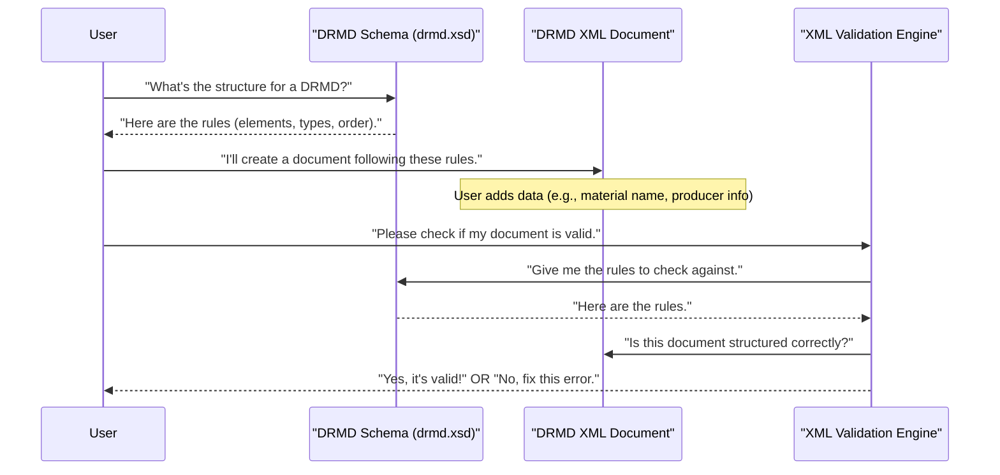

# Chapter 1: DRMD Document Schema

Welcome to the world of Digital Reference Material Documents, or DRMD! In this first chapter, we're going to explore the very foundation of how these digital documents are built: the **DRMD Document Schema**.

Imagine you want to create a special digital certificate for a reference material, like a certified sugar sample used in labs. This certificate needs to contain specific information: the material's name, its properties, who produced it, and so on. But not just any information – it needs to be organized in a way that *everyone* (both humans and computers) can easily understand and process.

This is where the DRMD Document Schema comes in. It's like the official blueprint or rulebook that ensures every single DRMD certificate looks and behaves consistently. Without it, every digital certificate could be formatted differently, leading to confusion and making it impossible for machines to "read" and compare them automatically.

### What is a DRMD Document Schema?

At its core, the DRMD Document Schema is a special file named `drmd.xsd`. This file defines the **structure and rules** for all DRMD documents. Think of it as:

*   **The Blueprint**: If a DRMD document is a house, the schema is its architectural blueprint, showing where every room, window, and door must be.
*   **The Grammar and Vocabulary**: If a DRMD document is a sentence, the schema tells you what words you can use, how to spell them, and how to combine them into valid sentences.

It dictates:

*   **What elements are allowed**: What "sections" or "tags" can be in your document (e.g., `<administrativeData>`, `<materials>`).
*   **What attributes they can have**: Extra details attached to these sections (e.g., `schemaVersion="0.3.0"`).
*   **Their order**: The sequence in which these sections must appear.
*   **Their data types**: What kind of information goes inside (e.g., text, numbers, dates).
*   **Their relationships**: How different sections connect to each other.

By following this blueprint, all DRMD XML files achieve a crucial level of **consistency**, making them universally understandable and usable.

### Understanding the Building Blocks: XML and XSD

To really grasp the schema, let's briefly look at two important terms:

1.  **XML (eXtensible Markup Language)**: This is the format DRMD documents are written in. It uses "tags" to define pieces of information, creating a structured, hierarchical document.

    Here's a tiny glimpse of what a DRMD XML file might start to look like:

    ```xml
    <drmd:digitalReferenceMaterialDocument schemaVersion="0.3.0"
                                         xmlns:drmd="https://example.org/drmd">
        <!-- This is where all the certificate information goes -->
        <drmd:administrativeData>
            <!-- Details about the document and producer -->
        </drmd:administrativeData>
        <drmd:materials>
            <!-- Information about the reference material itself -->
        </drmd:materials>
        <!-- ... more sections ... -->
    </drmd:digitalReferenceMaterialDocument>
    ```

    In this example:
    *   `<drmd:digitalReferenceMaterialDocument>` is the main container, often called the "root element".
    *   `schemaVersion="0.3.0"` is an **attribute** providing extra information about the document version.
    *   `<drmd:administrativeData>` and `<drmd:materials>` are other **elements** inside the main container.

2.  **XSD (XML Schema Definition)**: This is our `drmd.xsd` file. It's the "rulebook" that defines what is *allowed* in any DRMD XML file. It ensures your XML is structured correctly.

    Let's peek at a very small part of the `drmd.xsd` file:

    ```xml
    <xs:simpleType name="schemaVersionType">
        <xs:restriction base="xs:string">
            <xs:pattern value="\d+\.\d+\.\d+"/>
        </xs:restriction>
    </xs:simpleType>

    <xs:element name="digitalReferenceMaterialDocument"
                type="drmd:digitalReferenceMaterialDocumentType"/>

    <xs:complexType name="digitalReferenceMaterialDocumentType">
        <xs:sequence>
            <xs:element name="administrativeData" type="drmd:administrativeDataType"/>
            <xs:element name="materials" type="drmd:materialListType"/>
            <!-- ... other required elements ... -->
        </xs:sequence>
        <xs:attribute name="schemaVersion"
                      type="drmd:schemaVersionType"
                      use="required"/>
    </xs:complexType>
    ```

    This snippet shows:
    *   `xs:simpleType`: Defines a simple rule for text, like `schemaVersionType` which must follow the pattern "number.number.number" (e.g., "0.3.0").
    *   `xs:element`: Declares a tag like `digitalReferenceMaterialDocument` and says it should follow a specific "type" of structure.
    *   `xs:complexType`: Defines a more complex structure, like `digitalReferenceMaterialDocumentType`, which contains other elements (`xs:sequence` means they must appear in this order) and attributes (`xs:attribute`).
    *   `use="required"`: This tells us that the `schemaVersion` attribute *must* be present in the document.

### Where is the DRMD Schema?

In the `drmd` project, the main schema file is located at `v0.3.0/xsd/drmd.xsd`. This is the single source of truth for defining the structure of all DRMD documents.

The `drmd.xsd` file also "imports" definitions from other standard schemas, like `dcc.xsd` (for Digital Calibration Certificate) and `SI_Format.xsd` (for SI units). Think of it like a chef using ingredients from different cookbooks to create a unique dish. This reuses existing, well-defined standards, making DRMD even more powerful and compatible.

### How the Schema Helps You Create DRMDs

When you set out to create a DRMD XML file (for example, using the [Streamlit Web Application](03_streamlit_web_application_.md)), you don't have to memorize all the rules. The schema acts as a guide. Any tool that helps you create DRMDs will use this schema to make sure you're filling in the right information in the right places.

For instance, if the schema says a certain field must be a date, and you try to enter plain text, the schema will tell you it's wrong. This prevents errors and ensures your document is valid and machine-readable.

Here’s a simple illustration of the process:



### Conclusion

The DRMD Document Schema is the essential blueprint for creating consistent and machine-readable Digital Reference Material Documents. It defines every detail, from the main sections to the smallest piece of data, ensuring that all DRMDs speak the same language. By understanding this foundation, we can confidently create and interpret these important digital certificates.

Next, we'll dive into how we actually *check* if an XML document faithfully follows this blueprint. Get ready to learn about the validation process!

[Next Chapter: XML Validation Engine](02_xml_validation_engine_.md)
