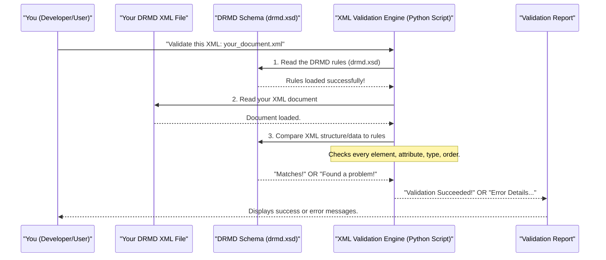

# Chapter 2: XML Validation Engine

Welcome back! In [Chapter 1: DRMD Document Schema](01_drmd_document_schema_.md), we learned that the `drmd.xsd` file is like a blueprint or rulebook for all Digital Reference Material Documents. It tells us exactly how a DRMD XML file should be structured, what information it must contain, and in what order.

But what if you create an XML file that's *supposed* to be a DRMD, but you accidentally miss a required section or misspell a tag? How do you know if your document truly follows the blueprint? This is where the **XML Validation Engine** comes in!

### What Problem Does it Solve?

Imagine you're building a house, and you have a detailed blueprint. After construction, you'd want someone to inspect it to ensure it perfectly matches the blueprint, right? You wouldn't want a wall in the wrong place or a door missing.

In the world of DRMD, the **XML Validation Engine** acts as that inspector. Its job is to perform **quality control** on your DRMD XML files. It's like a sophisticated spell-checker and grammar-checker specifically for XML documents against their schema.

**Central Use Case**: You've just created a new DRMD XML certificate for a reference material. Before sharing it with anyone or using it in an automated system, you absolutely need to make sure it's *valid*. A small mistake, like a missing required attribute or an incorrect data type, can make the entire document unusable by machines. The XML Validation Engine prevents these errors.

### What is XML Validation?

XML Validation is the process of checking an XML document against a set of rules defined in an XML Schema (like our `drmd.xsd`). It confirms:

*   **Structural Integrity**: Are all the required elements present? Are they in the correct order? Are there any unexpected elements?
*   **Data Consistency**: Does the data inside the elements match the expected types (e.g., is a date field actually a date, or is a number field truly a number)?
*   **Compliance**: Does the document strictly adhere to the DRMD standard?

This rigorous checking ensures that all DRMD XML files are reliable, consistent, and machine-readable, making them interoperable across different systems.

### How to Use the XML Validation Engine

The `drmd` project provides a simple Python script to validate your XML files. It uses a powerful library called `lxml` (which stands for libxml2/libxslt, a fast and robust XML toolkit) to do the heavy lifting.

Let's look at how you might use it from your command line:

```bash
python scripts/validate_v0_2.py your_document.xml v0.3.0/xsd/drmd.xsd
```

*   `scripts/validate_v0_2.py`: This is the validation script.
*   `your_document.xml`: This is *your* DRMD XML file that you want to check.
*   `v0.3.0/xsd/drmd.xsd`: This is the official DRMD schema (the rulebook) you want to validate against.

If your `your_document.xml` is perfectly structured according to `drmd.xsd`, you'll see a success message:

```
Validation succeeded
```

However, if there's an error, the engine will tell you exactly what went wrong and where:

```
lxml.etree.XMLSyntaxError: Element 'name': This element is not expected. Expected is (administrativeData)., line 10, column 1
```
This error message tells us that at "line 10, column 1" of our XML, the element `name` was found, but the schema expected `administrativeData` at that point. This helps you pinpoint and fix the mistake quickly!

### A Simple Code Example for Validation

The core logic of validation is quite straightforward. Here’s a simplified version of the Python code that performs the validation:

```python
from lxml import etree # This is our XML toolkit

def check_my_drmd_file(xml_file_path, schema_file_path):
    # 1. Load the blueprint (DRMD Schema)
    with open(schema_file_path, 'rb') as f:
        schema_definition = etree.parse(f)
        drmd_rules = etree.XMLSchema(schema_definition) # Compile the rules

    # 2. Load the house (Your DRMD XML file)
    your_drmd_document = etree.parse(xml_file_path)

    # 3. Perform the inspection!
    # If there are errors, this line will stop the program and tell you.
    drmd_rules.assertValid(your_drmd_document)

    # If we reach here, no errors were found!
    print("Hooray! Your DRMD XML is perfectly valid!")

# Example of how this function would be called:
# check_my_drmd_file("my_wrong_document.xml", "drmd.xsd")
```

This small function takes your XML file and the schema file, then uses `lxml` to load both. The crucial part is `drmd_rules.assertValid(your_drmd_document)`, which does all the heavy lifting of comparing your document against the schema. If even a tiny rule is broken, it raises an error, giving you a detailed report.

### How it Works Under the Hood

Let's break down the validation process with a simple diagram.



1.  **Read the Schema**: The `XML Validation Engine` first reads and understands the `DRMD Schema (drmd.xsd)`. It compiles these rules into an internal representation that it can quickly check against.
2.  **Read the XML Document**: Next, it loads your `DRMD XML File` into memory.
3.  **Compare and Validate**: The engine then goes through your XML document element by element, attribute by attribute, comparing everything against the rules it learned from the schema.
    *   Is `<administrativeData>` present? Is it before `<materials>` as required?
    *   Does `schemaVersion` have the format `X.Y.Z` (e.g., `0.3.0`)?
    *   If an element is supposed to contain a date, is the content actually a valid date format?
4.  **Report Results**: If everything matches the schema's rules, it declares the document **valid**. If it finds any deviation, it stops and reports the specific error, including the line number and a description of what was expected versus what was found.

### Code Deep Dive: `lxml` in Action

Let's look at the actual code snippet from `scripts/validate_v0_2.py` in the `drmd` project. It's concise because `lxml` does a lot for us.

```python
# File: scripts/validate_v0_2.py
from lxml import etree
import sys

def validate(xml_file, xsd_file):
    # Open and parse the XSD (schema) file
    with open(xsd_file, 'rb') as f:
        schema_doc = etree.parse(f)
        schema = etree.XMLSchema(schema_doc) # Compile the schema rules

    # Parse the XML document to be validated
    doc = etree.parse(xml_file)

    # Perform the validation. This will raise an error if invalid.
    schema.assertValid(doc)

if __name__ == '__main__':
    # This block runs when the script is executed directly
    if len(sys.argv) != 3:
        print('Usage: python validate_v0_2.py <xml_file> <xsd_file>')
        sys.exit(1)
    validate(sys.argv[1], sys.argv[2]) # Call the validation function
    print('Validation succeeded')
```

*   **`from lxml import etree`**: This line imports the `etree` module from the `lxml` library, which provides the tools needed to work with XML and XSD files in Python.
*   **`etree.parse(f)`**: This reads the content of the `drmd.xsd` file and turns it into a tree-like structure that `lxml` can understand.
*   **`etree.XMLSchema(schema_doc)`**: This is the critical step where `lxml` takes the parsed schema definition and *compiles* it. Think of this as the validation engine "learning" all the rules.
*   **`etree.parse(xml_file)`**: Similarly, this line reads your DRMD XML file.
*   **`schema.assertValid(doc)`**: This is where the actual validation happens. `lxml` compares `doc` (your XML file) against `schema` (the compiled rules from `drmd.xsd`). If the document is valid, the function simply continues. If there's an error, it stops the program and provides a detailed error message, making it easy to identify and fix issues.

The `drmd` project's [Streamlit Web Application](03_streamlit_web_application_.md) also uses this validation logic behind the scenes. When you upload an XML file to the web application or click "Generate XML," it automatically runs this check using the `DEFAULT_XSD_PATH` to ensure your data adheres to the DRMD standard. This is evident in `webapp/app_impl.py`:

```python
# File: webapp/app_impl.py (simplified snippet)
import lxml.etree as _etree # Used for schema validation

# ... (other code) ...

# In the sidebar file uploader section:
    try:
        # ... (load xml_bytes) ...
        # If the XML content changes, re-validate
        # DEFAULT_XSD_PATH is set to 'v0.3.0/xsd/drmd.xsd'
        schema_doc = _etree.parse(DEFAULT_XSD_PATH)
        _etree.XMLSchema(schema_doc).assertValid(_etree.parse(io.BytesIO(xml_bytes)))
        st.sidebar.success('XML schema validation: OK')
        # ... (store hash to avoid re-validating same content) ...
    except Exception as _e:
        first_line = str(_e).splitlines()[0]
        st.sidebar.error(f'Schema validation failed: {first_line}')
```

This shows the same `lxml` functions being used directly within the web application to provide instant feedback on the validity of your XML documents.

### Conclusion

The XML Validation Engine is an indispensable part of the `drmd` project. It ensures that every DRMD XML file strictly follows the blueprint defined in the `drmd.xsd` schema. By performing this critical quality control check, it prevents errors, guarantees consistency, and makes DRMD documents universally reliable and machine-processable. Now that we understand how DRMD documents are structured and how to validate them, we're ready to see how we can easily create these documents using a friendly interface!

[Next Chapter: Streamlit Web Application](03_streamlit_web_application_.md)
