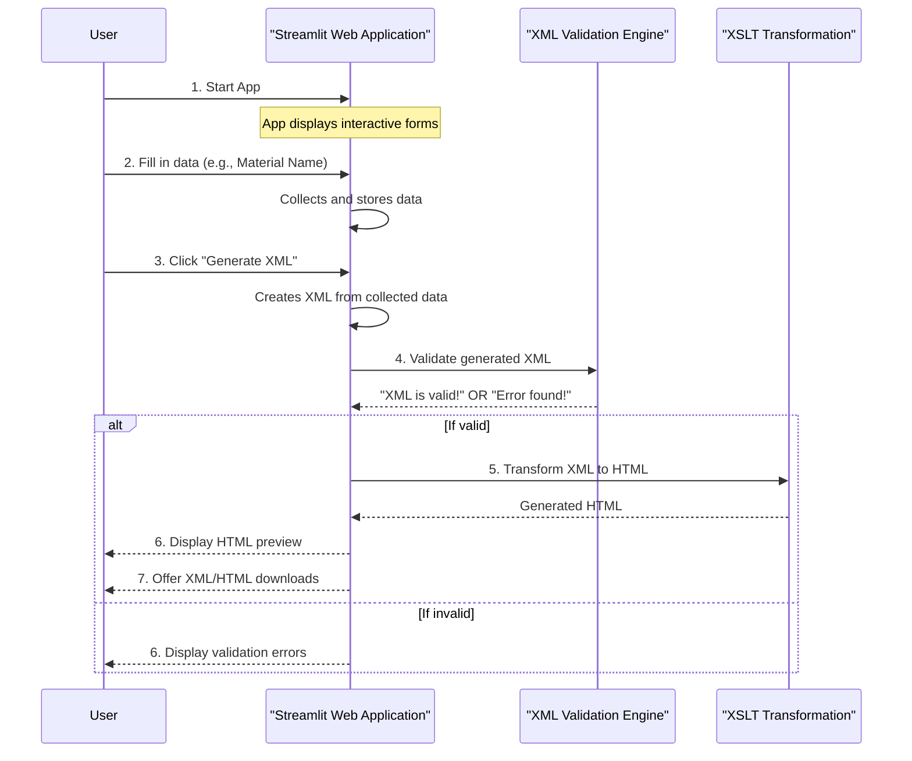

# Chapter 3: Streamlit Web Application

Welcome back! In [Chapter 1: DRMD Document Schema](01_drmd_document_schema_.md), we established the blueprint for Digital Reference Material Documents. Then, in [Chapter 2: XML Validation Engine](02_xml_validation_engine_.md), we learned how to rigorously check if an XML document faithfully follows that blueprint.

Now, imagine trying to create a complex DRMD XML file by hand, remembering all the element names, their order, and data types from the `drmd.xsd` schema. It would be a tedious and error-prone task! This is where the **Streamlit Web Application** comes to our rescue.

### What Problem Does it Solve?

The `drmd` project aims to make creating and managing DRMDs easy for everyone, not just XML experts. The **Streamlit Web Application** solves a crucial problem: **how to create and edit DRMD XML documents using a friendly, interactive graphical interface, without needing to write any code yourself.**

**Central Use Case**: You need to create a new Digital Reference Material Document for a certified reference material. Instead of manually typing out XML tags and values, you want to fill out simple forms on a webpage. The application should then take your input, generate the correct XML, validate it against the schema, and even show you how the final document will look as an HTML page. This is your digital workbench!

The Streamlit Web Application acts as a bridge, translating your simple form entries into complex, valid XML structures.

### What is Streamlit?

Streamlit is an amazing open-source Python library that lets you build interactive web applications with just a few lines of Python code. It's incredibly popular for quickly creating data applications, but it's also perfect for building tools like our DRMD editor.

Think of it this way:

*   **Your Code, Instantly a Web App**: You write a standard Python script, and Streamlit turns it into an interactive web page.
*   **Forms, Sliders, Buttons**: It provides easy-to-use widgets like text boxes, drop-down menus, and buttons that you can use to collect user input.
*   **Real-time Updates**: When you change something in a form, Streamlit automatically re-runs your script and updates the web page, showing you immediate feedback.

The `drmd` Streamlit app brings the power of the [DRMD Document Schema](01_drmd_document_schema_.md) and the [XML Validation Engine](02_xml_validation_engine_.md) to your browser, making the entire process intuitive and efficient.

### How to Use the Streamlit Web Application

Using the DRMD web application is straightforward:

1.  **Start the Application**:
    First, you need to make sure you have the project set up and its dependencies installed. You can do this by running `make install` (which we'll cover in more detail in [Chapter 6: Development Automation (Makefile)](06_development_automation__makefile__.md)). Once installed, you can start the application with a simple command:

    ```bash
    streamlit run webapp/app.py --server.headless true --server.port 8501
    ```
    This command tells Streamlit to run the `app.py` script located in the `webapp` folder. The `headless` and `port` options control how it runs; usually, it will open in your web browser automatically at an address like `http://localhost:8501`.

2.  **Interact with the User Interface**:
    Once running, you'll see a web page with several tabs, such as "Administrative Data", "Materials", "Properties", "Statements", and "Validate & Export". Each tab contains user-friendly forms to input specific parts of your DRMD document.

    *   **Fill out Forms**: Enter data into text boxes (like "Title of the Document"), select options from drop-downs, and add lists of items (like "Document Identifiers").
    *   **Immediate Feedback**: As you type, the application state updates.
    *   **Load Existing XML**: You can also upload an existing DRMD XML file using the "Load XML file" button in the sidebar. The application will then parse it and pre-fill the forms, allowing you to easily edit an existing document.
    *   **Generate XML & HTML**: After filling in your data, navigate to the "Validate & Export" tab. Click the "Generate XML" button. The application will then:
        *   Construct the XML document based on your input.
        *   Validate this XML against the `drmd.xsd` schema (using the [XML Validation Engine](02_xml_validation_engine_.md)).
        *   Transform the valid XML into an human-readable HTML document (using XSLT, which is the topic of [Chapter 4: XML to HTML Transformation (XSLT)](04_xml_to_html_transformation__xslt__.md)).
    *   **Download Outputs**: You can then download both the generated XML and HTML files. The application also provides an HTML preview directly on the page.

Here's a simplified view of how you interact with the app:



### Under the Hood: How the App Works

The Streamlit application for `drmd` is primarily built using Python code. Let's look at the core structure and how it integrates with the concepts from previous chapters.

1.  **The Launcher (`webapp/app.py`)**:
    This is the main entry point for the Streamlit application. It's quite minimal; its primary job is to set up the environment variables for file paths (like the XSD and XSL files) and then import the actual application logic from `webapp/app_impl.py`.

    ```python
    # File: webapp/app.py (simplified)
    import os, sys
    from pathlib import Path

    BASE_DIR = Path(__file__).resolve().parent.parent
    XSD_PATH = BASE_DIR / "v0.3.0" / "xsd" / "drmd.xsd"
    XSL_PATH = BASE_DIR / "v0.3.0" / "xsl" / "drmd.xsl"

    # Inject variables expected by the app implementation.
    DEFAULT_XSD_PATH = str(XSD_PATH)
    DEFAULT_XSL_PATH = str(XSL_PATH)

    # Import the original application source (vendored)
    from importlib import util
    _SRC_FILE = BASE_DIR / "webapp" / "app_impl.py"
    spec = util.spec_from_file_location("webapp_impl", _SRC_FILE)
    webapp_impl = util.module_from_spec(spec)
    sys.modules[spec.name] = webapp_impl
    spec.loader.exec_module(webapp_impl)

    # Re-export Streamlit context for the main app loop
    for name in dir(webapp_impl):
        if name.startswith('_'): continue
        globals()[name] = getattr(webapp_impl, name)
    ```
    This script ensures that the main application logic (`app_impl.py`) knows where to find the `drmd.xsd` schema and `drmd.xsl` stylesheet, making the application portable.

2.  **The Core Logic (`webapp/app_impl.py`)**:
    This file contains all the Streamlit UI code and the logic for building, validating, and transforming the XML.

    *   **Creating Input Fields**: Streamlit provides simple functions to create UI elements. For example, to get the "Title of the Document":

        ```python
        # From webapp/app_impl.py (simplified)
        import streamlit as st

        # ... (other code) ...

        st.selectbox(
            "Title of the Document",
            ["referenceMaterialCertificate", "productInformationSheet"],
            key="title_option", # Streamlit uses keys to manage state
        )
        ```
        `st.selectbox` creates a dropdown menu. When a user selects an option, Streamlit automatically updates `st.session_state.title_option`, storing the chosen value. `st.session_state` is a special Streamlit dictionary that remembers values across user interactions.

    *   **XML Generation**: When you click "Generate XML," the application collects all the data from `st.session_state` and uses Python's `xml.etree.ElementTree` library to construct the XML document according to the [DRMD Document Schema](01_drmd_document_schema_.md).

        ```python
        # From webapp/app_impl.py (simplified XML generation)
        import xml.etree.ElementTree as ET

        # ... (inside the "Generate XML" button logic) ...
        ns_drmd = "https://example.org/drmd"
        root = ET.Element(f"{{{ns_drmd}}}digitalReferenceMaterialDocument",
                          attrib={"schemaVersion": "0.3.0"})

        # Get the document title from the session state
        title_option = st.session_state.title_option
        admin_data = ET.SubElement(root, f"{{{ns_drmd}}}administrativeData")
        core_data = ET.SubElement(admin_data, f"{{{ns_drmd}}}coreData")
        ET.SubElement(core_data, f"{{{ns_drmd}}}titleOfTheDocument").text = title_option

        # ... (more elements added for materials, properties, etc.) ...
        ```
        Here, `ET.Element` creates XML tags, and `ET.SubElement` adds child tags, all following the rules defined in `drmd.xsd`.

    *   **XML Validation**: After generating the XML, the application uses the `lxml` library to validate it against `DEFAULT_XSD_PATH` (our `drmd.xsd` schema). This is exactly what we learned in [Chapter 2: XML Validation Engine](02_xml_validation_engine_.md)!

        ```python
        # From webapp/app_impl.py (simplified XML validation)
        import lxml.etree as _etree
        import io # For parsing XML from bytes

        # ... (after XML is generated as pretty_xml bytes) ...
        try:
            # Load the schema (drmd.xsd)
            schema_doc = _etree.parse(DEFAULT_XSD_PATH)
            schema = _etree.XMLSchema(schema_doc)
            # Validate the generated XML
            schema.assertValid(_etree.parse(io.BytesIO(pretty_xml)))
            st.success("XML is valid against the schema!")
        except Exception as e:
            st.error(f"XML is NOT valid against the schema! Error: {str(e).splitlines()[0]}")
        ```
        This code snippet directly uses `lxml.etree.XMLSchema` and `assertValid` to perform the validation, providing instant feedback to the user.

    *   **XML to HTML Transformation**: Finally, the application uses `lxml` again to apply the `drmd.xsl` stylesheet to the generated XML, producing an HTML output for preview and download. This process will be fully explored in [Chapter 4: XML to HTML Transformation (XSLT)](04_xml_to_html_transformation__xslt__.md).

        ```python
        # From webapp/app_impl.py (simplified XSL Transformation)
        # ... (after XML is generated as pretty_xml bytes) ...
        try:
            # Parse the XSL file
            xslt_doc = _etree.parse(DEFAULT_XSL_PATH)
            transform = _etree.XSLT(xslt_doc)
            # Parse the generated XML
            xml_doc = _etree.fromstring(pretty_xml)
            # Transform XML to HTML
            html_output = _etree.tostring(transform(xml_doc), pretty_print=True).decode("utf-8")
            st.components.v1.html(html_output, height=600, scrolling=True) # Display HTML
        except Exception as e:
            st.error(f"XSL Transformation Error: {e}")
        ```

The Streamlit Web Application is the interactive face of the `drmd` project, seamlessly combining user input with the underlying XML schema rules, validation logic, and transformation capabilities.

### Conclusion

The Streamlit Web Application is your friendly digital workbench for creating, editing, and validating DRMD documents. It simplifies the complex task of working with XML by providing an intuitive graphical interface. By filling out simple forms, you leverage the [DRMD Document Schema](01_drmd_document_schema_.md) and the [XML Validation Engine](02_xml_validation_engine_.md) without needing to understand their intricate details. This allows anyone to generate consistent and machine-readable DRMDs with ease.

Next, we'll dive into how these structured XML documents are transformed into beautiful, human-readable HTML pages.

[Next Chapter: XML to HTML Transformation (XSLT)](04_xml_to_html_transformation__xslt__.md)