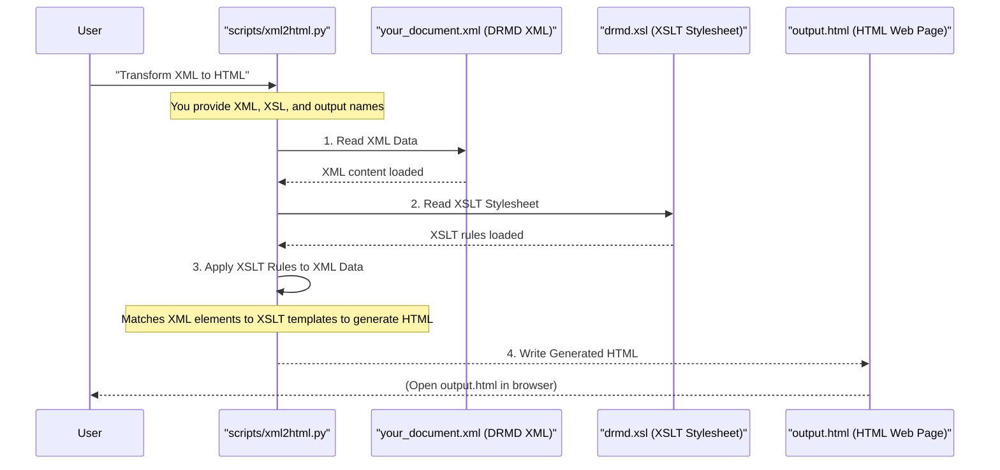

# Chapter 4: XML to HTML Transformation (XSLT)

Welcome back! In [Chapter 3: Streamlit Web Application](03_streamlit_web_application_.md), we saw how our friendly web application helps us create and validate Digital Reference Material Documents in the XML format. You've now got this perfectly structured, machine-readable XML file. But here's the thing: raw XML data, with all its `<tags>` and attributes, isn't very easy for humans to read and understand at a glance.

### What Problem Does it Solve?

Imagine you've baked a delicious cake (your DRMD XML data), but it's still in the mixing bowl. To truly enjoy it, you need to frost it, decorate it, and present it nicely on a plate.

The **XML to HTML Transformation (XSLT)** process is like frosting and decorating your XML cake! It takes the raw, structured DRMD XML data and converts it into a beautifully formatted, human-readable HTML document. HTML is what web browsers understand, allowing you to view your DRMD certificate as a proper web page.

**Central Use Case**: You've just created a DRMD XML file using the Streamlit app, or you've received one from another system. You want to view this technical information in a clear, accessible, and user-friendly way in any web browser, just like a regular webpage. This transformation is crucial for presenting the complex DRMD information in a simple, understandable format.

### What is XSLT?

XSLT stands for **eXtensible Stylesheet Language Transformations**. Don't let the fancy name scare you! Think of it this way:

*   **XML**: Your raw data (like a recipe written in a very structured, code-like way).
*   **XSLT Stylesheet**: The set of instructions that tells you *how* to present that data (like a chef's artistic guide on plating the dish).
*   **HTML**: The final, beautifully presented dish ready for consumption (your web page).

XSLT is a special language designed specifically for transforming XML documents into other document formats, most commonly HTML. It uses rules, called "templates," to match parts of your XML document and define how they should look in the output.

### The Key Ingredients: XML and XSL

To perform this transformation, you need two main files:

1.  **Your DRMD XML Document**: This is the input file, containing all the structured data about your reference material, as learned in [Chapter 1: DRMD Document Schema](01_drmd_document_schema_.md). For example:
    ```xml
    <drmd:digitalReferenceMaterialDocument schemaVersion="0.3.0"
                                         xmlns:drmd="https://example.org/drmd">
        <drmd:administrativeData>
            <drmd:coreData>
                <drmd:titleOfTheDocument>referenceMaterialCertificate</drmd:titleOfTheDocument>
                <drmd:uniqueIdentifier>BAM-F017</drmd:uniqueIdentifier>
                <!-- ... more core data ... -->
            </drmd:coreData>
            <!-- ... more administrative data ... -->
        </drmd:administrativeData>
        <!-- ... more sections like materials, properties, statements ... -->
    </drmd:digitalReferenceMaterialDocument>
    ```

2.  **The XSLT Stylesheet (`drmd.xsl`)**: This is the "recipe" for the transformation. It tells the XSLT engine exactly how to convert each XML element into its corresponding HTML representation. Our project uses `v0.3.0/xsl/drmd.xsl`. A small part of it might look like this:
    ```xml
    <?xml version="1.0" encoding="UTF-8"?>
    <xsl:stylesheet version="1.0" xmlns:xsl="http://www.w3.org/1999/XSL/Transform" xmlns:drmd="https://example.org/drmd">
        <xsl:output method="html" indent="yes" />

        <xsl:template match="/">
          <html>
            <head>
              <title><xsl:value-of select="drmd:digitalReferenceMaterialDocument/drmd:administrativeData/drmd:coreData/drmd:titleOfTheDocument" /></title>
              <!-- ... styling information ... -->
            </head>
            <body>
              <h1><xsl:value-of select="drmd:digitalReferenceMaterialDocument/drmd:administrativeData/drmd:coreData/drmd:titleOfTheDocument" /></h1>
              <h2>Administrative Data</h2>
              <h3>Core Data</h3>
              <table>
                <tr>
                  <th>Title</th>
                  <td><xsl:value-of select="drmd:digitalReferenceMaterialDocument/drmd:administrativeData/drmd:coreData/drmd:titleOfTheDocument" /></td>
                </tr>
                <tr>
                  <th>Unique Identifier</th>
                  <td><xsl:value-of select="drmd:digitalReferenceMaterialDocument/drmd:administrativeData/drmd:coreData/drmd:uniqueIdentifier" /></td>
                </tr>
                <!-- ... more table rows for other data ... -->
              </table>
              <!-- ... rest of the document ... -->
            </body>
          </html>
        </xsl:template>

        <!-- ... other templates for materials, properties, etc. ... -->

    </xsl:stylesheet>
    ```
    In this snippet:
    *   `<xsl:template match="/">`: This is the main rule, matching the very beginning of the XML document.
    *   Inside this template, we define the basic HTML structure (`<html>`, `<head>`, `<body>`).
    *   `<xsl:value-of select="..."/>`: This instruction tells the XSLT engine to find a specific XML element (like `drmd:titleOfTheDocument`) and insert its text content directly into the HTML at that spot. For instance, the XML title "referenceMaterialCertificate" becomes the `<h1>` heading on the HTML page.

### How to Use the XML to HTML Transformation

The `drmd` project provides a simple Python script, `scripts/xml2html.py`, to perform this transformation from your command line.

**Example**:
Let's say you have an XML file named `my_certificate.xml`. You can transform it into an HTML file:

```bash
python scripts/xml2html.py my_certificate.xml v0.3.0/xsl/drmd.xsl my_certificate.html
```

*   `scripts/xml2html.py`: This is the script that performs the transformation.
*   `my_certificate.xml`: This is your input DRMD XML file.
*   `v0.3.0/xsl/drmd.xsl`: This is the XSLT stylesheet that contains the rules for transformation.
*   `my_certificate.html`: This is the name of the output HTML file that will be created.

After running this command, you will find a new `my_certificate.html` file in the same directory. You can open this HTML file directly in any web browser to see your DRMD certificate presented as a readable web page.

Here’s a high-level conceptual output that `drmd.xsl` would produce for a simplified DRMD XML:

```html
<!DOCTYPE html>
<html>
<head>
    <title>referenceMaterialCertificate</title>
    <style> /* ... CSS styling for the page ... */ </style>
</head>
<body>
    <h1>referenceMaterialCertificate</h1>
    <h2>Administrative Data</h2>
    <h3>Core Data</h3>
    <table>
        <tr>
            <th>Title</th>
            <td>referenceMaterialCertificate</td>
        </tr>
        <tr>
            <th>Unique Identifier</th>
            <td>BAM-F017</td>
        </tr>
    </table>
    <!-- ... formatted content for materials, properties, statements ... -->
</body>
</html>
```

### Under the Hood: How it Works

Let's look at the steps involved when you run the transformation script or when the [Streamlit Web Application](03_streamlit_web_application_.md) generates an HTML preview:



1.  **Read XML Data**: The Python script first reads your DRMD XML file. It loads the entire structured XML content into memory.
2.  **Read XSLT Stylesheet**: Next, it reads the `drmd.xsl` stylesheet. This stylesheet contains all the instructions (templates) on how to convert the XML elements into HTML.
3.  **Apply Transformation Rules**: This is the core step. The XSLT engine (powered by the `lxml` library in Python) goes through the XML document. For each XML element it encounters, it looks for a matching `xsl:template` in the `drmd.xsl` file. When it finds a match, it applies the rules defined in that template to generate the corresponding HTML code. For example, when it sees `<drmd:titleOfTheDocument>`, a template might tell it to create an `<h1>` tag with the text content of that XML element.
4.  **Write HTML Output**: As the transformation progresses, the generated HTML content is collected. Finally, the script writes this complete HTML content into your specified output `.html` file.

### Code Deep Dive: `lxml` in Action

The `drmd` project uses the `lxml` library in Python to perform XSLT transformations. This is the same powerful library used by the [XML Validation Engine](02_xml_validation_engine_.md).

Let's look at simplified snippets from `scripts/xml2html.py` and `webapp/app_impl.py`:

**1. Loading XML and XSLT files:**
```python
# From scripts/xml2html.py (simplified)
from lxml import etree as ET # Our XML toolkit

def transform_xml(xml_file_path, xslt_file_path, output_html_path):
    # Parse the XML data file
    xml_tree = ET.parse(xml_file_path)

    # Parse the XSLT stylesheet file
    xslt_tree = ET.parse(xslt_file_path)
    # ... rest of the code ...
```
Here, `ET.parse()` is used twice: once to load your input XML document (`xml_tree`) and once to load the transformation rules from the `drmd.xsl` stylesheet (`xslt_tree`).

**2. Creating the Transformer and Performing Transformation:**
```python
# From scripts/xml2html.py (simplified)
# ... (after parsing files) ...

    # Create an XSLT transformer object from the stylesheet
    transform = ET.XSLT(xslt_tree)

    # Apply the transformation to the XML tree
    result_tree = transform(xml_tree)

    # ... rest of the code ...
```
`ET.XSLT(xslt_tree)` takes the parsed stylesheet and prepares it to perform transformations. Then, `transform(xml_tree)` is the magic step where the rules from `drmd.xsl` are applied to your `my_certificate.xml`, resulting in a new tree structure, `result_tree`, which now represents the HTML content.

**3. Saving the HTML Output:**
```python
# From scripts/xml2html.py (simplified)
# ... (after transformation) ...

    # Convert the resulting tree to a formatted HTML string
    html_bytes = ET.tostring(result_tree, pretty_print=True, method="html")

    # Write the HTML string to an output file
    with open(output_html_path, 'wb') as html_file:
        html_file.write(html_bytes)
```
Finally, `ET.tostring()` converts the `result_tree` (which is now an HTML structure) into a stream of bytes. The `method="html"` argument ensures it's formatted as standard HTML. This byte stream is then written to a file, creating your new `.html` document.

The [Streamlit Web Application](03_streamlit_web_application_.md) uses these very same `lxml` functions to generate the HTML preview you see directly within the browser, utilizing the `DEFAULT_XSL_PATH` which points to `v0.3.0/xsl/drmd.xsl`. This allows for instant visualization of your DRMD as a web page as you build it.

### Conclusion

The XML to HTML Transformation (XSLT) is a powerful mechanism that makes the `drmd` project truly user-friendly. It acts as the bridge between structured, machine-readable XML data and beautifully formatted, human-readable web pages. By applying the rules defined in the `drmd.xsl` stylesheet, we can easily present complex DRMD information in an accessible way for everyone. Whether through a command-line script or the integrated Streamlit application, XSLT ensures that your digital certificates are not just valid, but also visually appealing and easy to understand.

Next, we'll look at how the `drmd` project integrates with other important data standards to make its documents even more robust and interoperable.

[Next Chapter: External Data Standards (DCC, QUDT)](05_external_data_standards__dcc__qudt__.md)