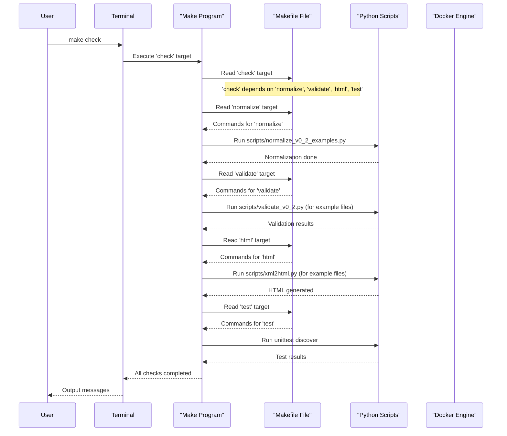

# Chapter 6: Development Automation (Makefile)

Welcome back! In [Chapter 5: External Data Standards (DCC, QUDT)](05_external_data_standards__dcc__qudt__.md), we explored how our Digital Reference Material Documents (`DRMD`s) gain global meaning by integrating with established scientific standards. We've seen how `DRMD`s are structured, validated, transformed into HTML, and enriched with external data.

Now, imagine you're a developer working on the `drmd` project. Every day, you might need to:
*   Set up your development environment.
*   Install all necessary tools.
*   Run tests to ensure everything is working correctly.
*   Validate all example `DRMD` XML files.
*   Generate HTML versions of those `DRMD`s.
*   Start the [Streamlit Web Application](03_streamlit_web_application_.md).

Doing all these tasks manually, remembering every command, and typing them out each time can be tedious and prone to errors. This is where **Development Automation** using a **Makefile** comes to our rescue!

### What Problem Does it Solve?

Think of building a complex LEGO castle. You have many different steps: sorting bricks, assembling walls, adding a roof, checking for stability. If you had to remember every single step and execute them perfectly in order each time you built a new castle, it would be a lot of work!

The **Makefile** solves the problem of **automating repetitive development tasks**. It acts as a central "command center" or a "recipe book" for your project. Instead of typing many long, complex commands, you can just tell `make` (the "chef") what you want to achieve (e.g., "build the castle"), and it will follow the pre-defined recipe.

**Central Use Case**: As a developer, you've just pulled the latest changes from the `drmd` project. You want to make sure your environment is set up, all example files are validated, and the HTML outputs are generated, all with a single, simple command. The Makefile allows you to do this effortlessly.

### What is a Makefile?

A `Makefile` is a special file (usually named `Makefile` without any extension) that contains a set of instructions for building or managing a software project. These instructions are organized into what are called **targets** (or "recipes").

Each target defines:
*   **What to do**: A list of commands to execute.
*   **What it depends on**: Other targets or files that must be completed first.

When you run `make` followed by a target name (e.g., `make install`), `make` finds that target in the `Makefile` and executes all its commands. If a target depends on another, `make` will automatically run the dependency first.

This ensures:
*   **Consistency**: Everyone runs the same commands in the same order.
*   **Efficiency**: You avoid re-typing commands and `make` can intelligently skip steps if nothing has changed.
*   **Simplicity**: Complex workflows are reduced to simple commands.

### How to Use the `drmd` Makefile

Let's look at some common tasks you can automate in the `drmd` project using the `Makefile`. You'll use the `make` command followed by the name of the "recipe" you want to run.

**1. Setting up your project (installing dependencies)**

Before you can run any Python scripts or the Streamlit app, you need to set up your Python environment and install the required libraries.

```bash
make install
```

**What happens:**
*   `make` first checks if a virtual environment (`.venv`) exists. If not, it creates one.
*   Then, it uses `pip` (the Python package installer) within that virtual environment to install all the libraries listed in `webapp/requirements.txt`.
*   This prepares your system to run the `drmd` tools.

**2. Validating example DRMD XML files**

You learned about the [XML Validation Engine](02_xml_validation_engine_.md) in Chapter 2. Instead of typing the full `python scripts/validate_v0_2.py ...` command for each file, you can just run:

```bash
make validate
```

**What happens:**
*   `make` runs the `scripts/validate_v0_2.py` script for two example XML files (`BAM-F017.xml` and `BAM-M375a.xml`) against the `drmd.xsd` schema.
*   If both are valid, you'll see "Validation succeeded" messages. If there's an error in any file, `make` will stop and show you the error, just as we saw in Chapter 2.

**3. Generating HTML output from XML files**

Remember [Chapter 4: XML to HTML Transformation (XSLT)](04_xml_to_html_transformation__xslt__.md)? You can convert all example XML files to beautiful HTML with a single command:

```bash
make html
```

**What happens:**
*   `make` first creates a `v0.3.0/html` directory if it doesn't exist.
*   Then, it runs the `scripts/xml2html.py` script for each example XML file, transforming it into an HTML file using `drmd.xsl`.
*   You'll find `BAM-F017.html` and `BAM-M375a.html` in the `v0.3.0/html` directory.

**4. Running all quality checks (validation, HTML generation, tests)**

This is the central use case! To run a suite of checks to ensure everything is in order:

```bash
make check
```

**What happens:**
*   `make` will first run `normalize` (which cleans up XML formatting, similar to validation).
*   Then it will run `validate`.
*   Next, it will run `html`.
*   Finally, it will run `test` (which executes all unit tests defined for the project, making sure the code itself is working as expected).
*   This single command provides a comprehensive check of the project's state.

**5. Starting the Streamlit Web Application**

To launch the [Streamlit Web Application](03_streamlit_web_application_.md) (your friendly DRMD editor):

```bash
make app
```

**What happens:**
*   `make` executes the `streamlit run webapp/app.py` command with some options.
*   This will open the web application in your browser (usually at `http://localhost:8501`), ready for you to create or edit `DRMD`s.

**6. Building and Running a Docker Container**

If you want to run the `drmd` Streamlit application in an isolated environment (like a lightweight virtual machine), you can use Docker. The `Makefile` also automates these steps.

```bash
make docker-build
make docker-run
```

**What happens:**
*   `make docker-build`: Uses the `Dockerfile` (a set of instructions for building a Docker image) to create a `drmd-app` image. This packages the entire application and its dependencies into a reproducible unit.
*   `make docker-run`: Starts a Docker container from the `drmd-app` image. It maps port `8501` from the container to your computer, so you can access the Streamlit app in your browser at `http://localhost:8501`.

### Under the Hood: How the Makefile Works

Let's peek inside the `Makefile` to see how these automated tasks are defined.



The `Makefile` defines variables, special declarations, and target-specific commands:

**1. Variables for Easy Management**

The `Makefile` starts by defining some variables. This makes it easier to change paths or commands in one place.

```makefile
# File: Makefile (snippet)
VENV=.venv
PY=$(VENV)/bin/python
PIP=$(VENV)/bin/pip
```
*   `VENV`: Points to the name of our Python virtual environment folder.
*   `PY`: Represents the Python executable *inside* our virtual environment.
*   `PIP`: Represents the `pip` installer *inside* our virtual environment.
Whenever `$(VENV)`, `$(PY)`, or `$(PIP)` appear in the `Makefile`, `make` replaces them with their defined values.

**2. `.PHONY` - Declaring Targets that Aren't Files**

Sometimes, a target doesn't create a file. For instance, `install` doesn't create an "install" file; it performs an action. `.PHONY` tells `make` these are always-run actions, not files to be built.

```makefile
# File: Makefile (snippet)
.PHONY: help venv install normalize validate html test check app docker-build docker-run
```
This line explicitly lists all targets that `make` should always run, regardless of whether a file with that name exists.

**3. The `install` Target (Setting up the Environment)**

This target handles the initial setup.

```makefile
# File: Makefile (snippet)
install: venv
	$(PIP) install --upgrade pip
	$(PIP) install -r webapp/requirements.txt
```
*   `install: venv`: This line says the `install` target *depends* on the `venv` target. So, `make` will execute `venv` first.
*   `$(PIP) install ...`: These are the actual commands. The `$(PIP)` variable is expanded to `/path/to/.venv/bin/pip`.

**4. The `validate` Target (Using the Validation Engine)**

This target uses the Python script we discussed in [Chapter 2: XML Validation Engine](02_xml_validation_engine_.md).

```makefile
# File: Makefile (snippet)
validate: install
	$(PY) scripts/validate_v0_2.py v0.3.0/xml/BAM-F017.xml v0.3.0/xsd/drmd.xsd
	$(PY) scripts/validate_v0_2.py v0.3.0/xml/BAM-M375a.xml v0.3.0/xsd/drmd.xsd
```
*   `validate: install`: The `validate` target depends on `install`, ensuring all Python packages are ready.
*   `$(PY) scripts/validate_v0_2.py ...`: These lines execute the validation script for specific example files.

**5. The `html` Target (XML to HTML Transformation)**

This target uses the transformation script from [Chapter 4: XML to HTML Transformation (XSLT)](04_xml_to_html_transformation__xslt__.md).

```makefile
# File: Makefile (snippet)
html: install
	mkdir -p v0.3.0/html
	$(PY) scripts/xml2html.py v0.3.0/xml/BAM-F017.xml v0.3.0/xsl/drmd.xsl v0.3.0/html/BAM-F017.html
	$(PY) scripts/xml2html.py v0.3.0/xml/BAM-M375a.xml v0.3.0/xsl/drmd.xsl v0.3.0/html/BAM-M375a.html
```
*   `html: install`: Again, it depends on `install`.
*   `mkdir -p ...`: Creates the output directory for HTML files.
*   `$(PY) scripts/xml2html.py ...`: Executes the HTML transformation script for the example files.

**6. The `check` Target (Combining Multiple Tasks)**

This is a meta-target that groups several other targets for a full project health check.

```makefile
# File: Makefile (snippet)
check: normalize validate html test
```
*   `check: normalize validate html test`: This tells `make` that to run `check`, it first needs to run `normalize`, then `validate`, then `html`, and finally `test`. `make` handles the order and dependencies automatically.

**7. Docker Targets (Containerizing the Application)**

The `Makefile` also simplifies working with Docker for consistent deployments.

```makefile
# File: Makefile (snippet)
docker-build:
	docker build -t drmd-app:latest .

docker-run:
	docker run --rm -p 8501:8501 \
	  -e DRMD_XSD_PATH=/app/v0.3.0/xsd/drmd.xsd \
	  -e DRMD_XSL_PATH=/app/v0.3.0/xsl/drmd.xsl \
	  -e QUDT_TTL_PATH=/app/imports/qudt.ttl \
	  drmd-app:latest
```
*   `docker build ...`: This command reads the `Dockerfile` and creates a Docker image named `drmd-app:latest`.
*   `docker run ...`: This command starts a new Docker container from that image, mapping ports and setting environment variables so the Streamlit app can find its necessary files (XSD, XSL, QUDT data).

By defining these tasks in a `Makefile`, the `drmd` project ensures that development, testing, and deployment processes are consistent, efficient, and easy to manage for anyone working on the project.

### Conclusion

The `Makefile` is an indispensable tool for development automation in the `drmd` project. It transforms complex sequences of commands into simple, memorable targets, acting as a central control panel for managing the project's entire lifecycle. From setting up your environment and running comprehensive checks to generating outputs and launching the Streamlit app or a Docker container, the `Makefile` ensures consistency, reduces manual effort, and significantly streamlines the development workflow. It allows developers to focus more on building and improving `DRMD`s and less on repetitive command-line operations.