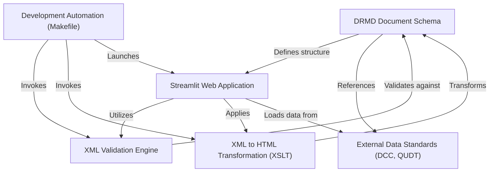

# Tutorial: drmd

The `drmd` project provides a comprehensive suite for managing **Digital Reference Material Documents**. It defines a *standardized XML schema* for these documents, offers a *web-based application* for user-friendly creation, editing, and validation, and includes *tools for transforming* these structured XML files into human-readable HTML. Furthermore, it integrates *external data standards* for rich metadata and streamlines development workflows with *automation scripts*.

## Visual Overview

## Chapters

1. [DRMD Document Schema
](01_drmd_document_schema_.md)
2. [XML Validation Engine
](02_xml_validation_engine_.md)
3. [Streamlit Web Application
](03_streamlit_web_application_.md)
4. [XML to HTML Transformation (XSLT)
](04_xml_to_html_transformation__xslt__.md)
5. [External Data Standards (DCC, QUDT)
](05_external_data_standards__dcc__qudt__.md)
6. [Development Automation (Makefile)
](06_development_automation__makefile__.md)
